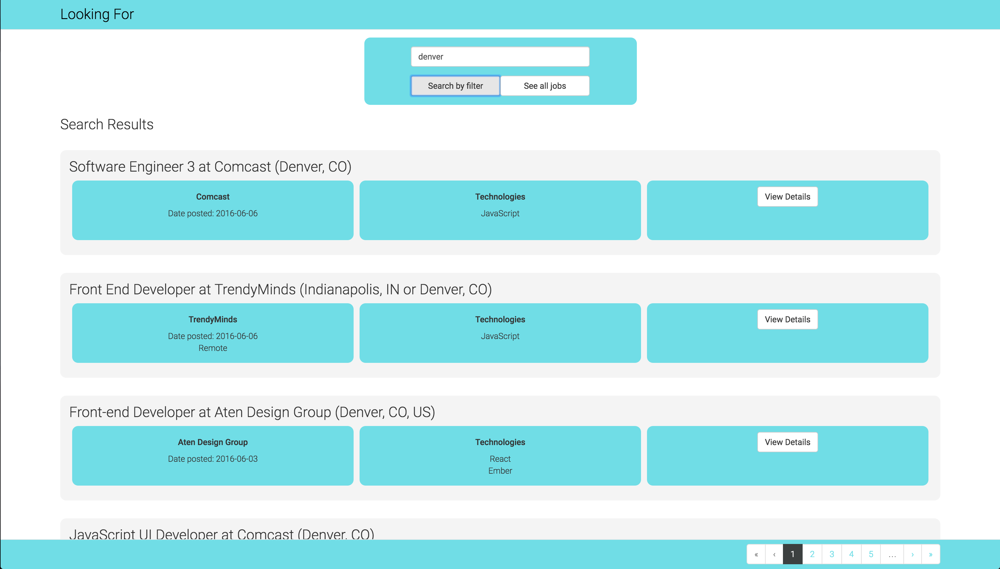

# LookingFor React Front End

##### React project setup with npm, webpack and babel.

- Tested with enzyme
- Styled with react-bootstrap
- ES6 and JSX style and syntax



## Purpose

A job searching tool that compiles Software Developer listings from multiple sites such as Stack Overflow and Indeed.

## 0. Up and Running

Clone the repo:

```
$ git clone git@github.com:LookingForMe/lookingForFrontEnd.git
```

Install the dependencies:

```
$ npm install
```

Start the dev server:

```
$ npm run dev
```
